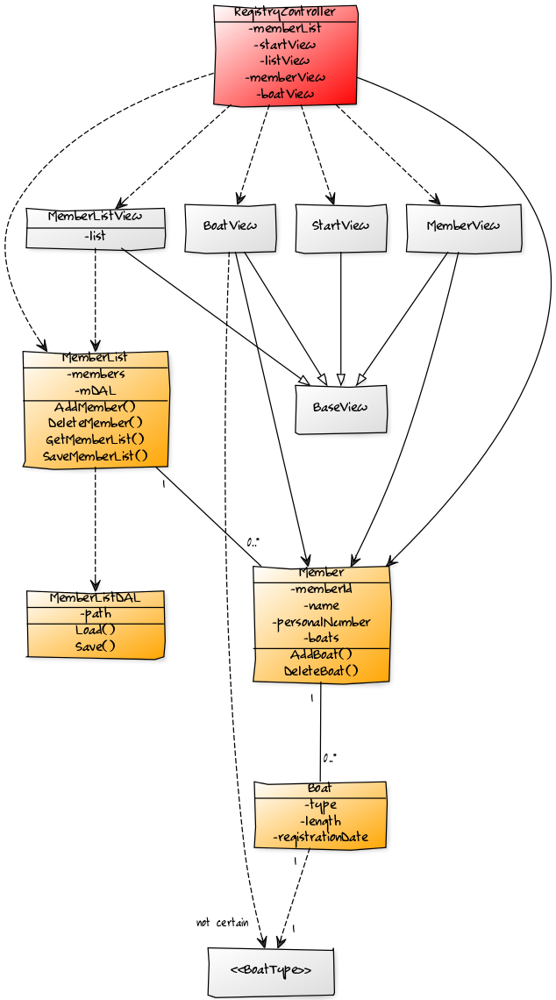

# Class Diagrams
#### StudentId: dt222cc

### Notes:
- I was not sure what scope the Class diagram should be in so I had one centered on Member and Boat with addition of new class MemberList and enum BoatTypes.

- The second/other ones has MVC to represent the application better.

- There is some other diagrams in the folder but they are outdated.

## Class diagram 1:

## Class diagram 2:
