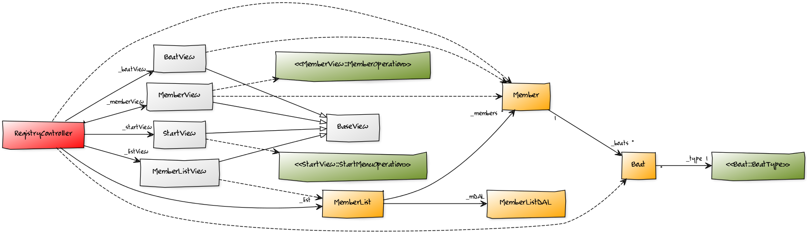

# Class Diagrams
#### StudentId: dt222cc

## Notes:
- The relation with BoatView is a bit tricky, it presents BoatTypes (so i'm probably missing a dependency to the BoatType enum). Receives a Member object and returns a Boat object "from" the Member object's boat list, which is why I chose to have a dependeny with the Member class.

## Class diagram:

<!--  -->