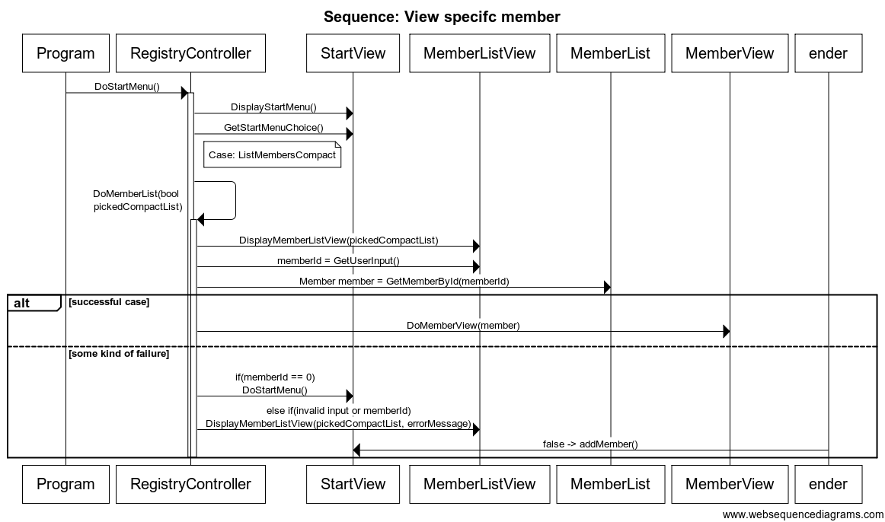

# Sequence Diagrams
#### StudentId: dt222cc

### Notes:
- I covered add member and view specific member, display startmenu is in it aswell, as the starting point.

## View specific member
- From the start menu: View members in compact or verbose list then pick specific member by memberId.

## Add member
- From the start menu: Pick add member. Input name then personal number. Redirect to the new member's memberview.
