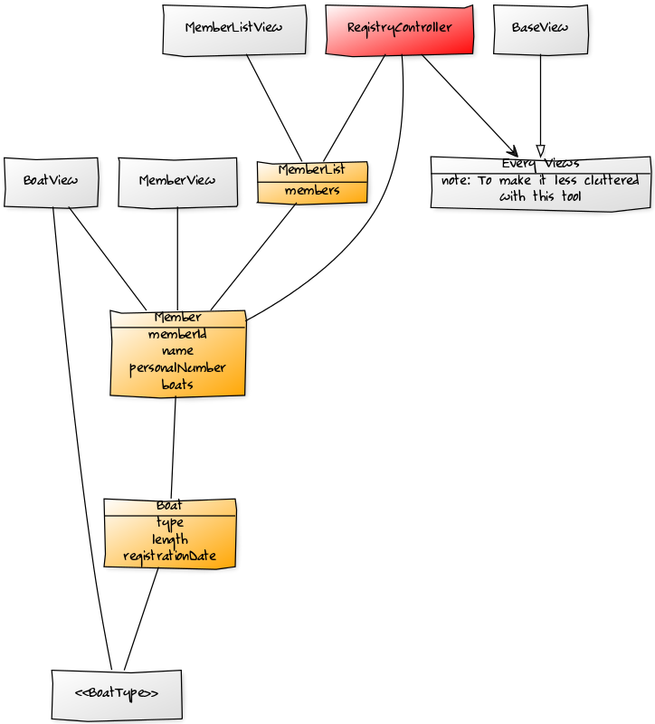
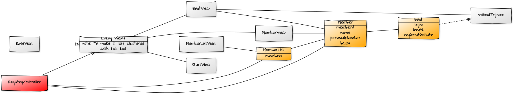
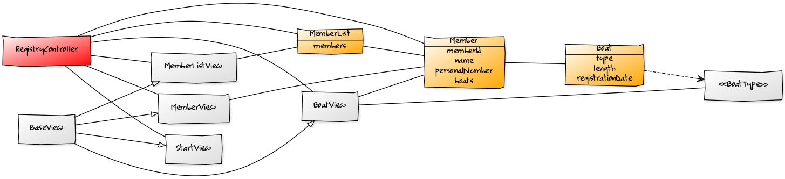

# Class Diagrams
#### StudentId: dt222cc

### Notes:
- I was not sure what scope the Class diagram should be in so I had one centered on Member and Boat with addition of new class MemberList and enum BoatTypes.
- The second/other ones has MVC in it with inspiration from the other class, PHP.

## This one should be sufficient:

-------------------------------------------------

## MVC, Structure of the application:

## MVC, (Same diagram):

## MVC, (Same diagram):
